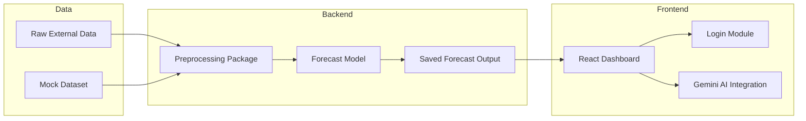

# DelDOT Revenue Forecast Admin Guide

## Purpose

This guide provides administrators with the information needed to operate, maintain, and extend the DelDOT Revenue Forecasting System.

## System Components

### Frontend

- `frontend_deldot/`
- Built with React, TypeScript, and Vite
- Uses `recharts`, `d3`, and Tailwind CSS for visualizations and styling
- Can be deployed as a static site or AI Studio app

### Backend / Data Processing

- `preprocessing/`
- `Model/DelDot1.py`
- Uses Python data pipelines for cleaning, feature engineering, and model inference
- Supports data export utilities and unit tests

### Data Sources

- `External_Data/TOTALSA.csv`
- Additional CSV or external datasets may be added for model improvement

## Deployment Overview

### Frontend Deployment Steps

1. Navigate to `frontend_deldot`
2. Install dependencies:
   ```bash
   npm install
   ```
3. Build the app:
   ```bash
   npm run build
   ```
4. Deploy the `dist/` directory to your chosen host

### Backend Deployment Options

- Deploy as a Python service or container
- Expose a REST API for frontend integration
- Use serverless functions for on-demand preprocessing tasks

## Architecture and Operations

### System Architecture



### Technology Stack Summary

- Python 3.8+ for backend
- `pandas`, `scikit-learn`, `scipy`
- React 19 + TypeScript for frontend
- Vite for build and development
- `@google/genai` for AI tooling
- Tailwind CSS for styling
- `dotenv` for environment configuration

## Admin Responsibilities

### Environment Management

- Maintain `.env.local` for local settings
- Keep `GEMINI_API_KEY` secure
- Ensure Node and Python versions match project requirements

### Data Management

- Add or update datasets in `External_Data/`
- Validate input CSV formats before preprocessing
- Backup processed results and model outputs

### Security

- Do not store secrets in version control
- Review dependencies for security updates
- Limit access to deployment credentials

### Monitoring and Maintenance

- Monitor deployed frontend availability
- Track errors in browser console or server logs
- Test new data pipelines before production use
- Keep package dependencies current

## Admin Tasks

### Restart Frontend

If the frontend needs to be restarted:

```bash
cd frontend_deldot
npm run dev
```

### Update Dependencies

- For Python:
  ```bash
  .venv\Scripts\activate
  pip install -e .
  ```
- For Node:
  ```bash
  cd frontend_deldot
  npm install
  ```

### Run Tests

- Python tests:
  ```bash
  .venv\Scripts\activate
  pytest
  ```

### Validate Build

- Frontend production build:
  ```bash
  cd frontend_deldot
  npm run build
  ```
- Confirm `dist/` directory contains static assets

## Change Management

- Use version control for all code and documentation updates
- Document data source changes and model retraining events
- Track deployment changes in release notes or changelogs

## Troubleshooting

### Common Issues

- **Frontend fails to start**: Check Node version, port availability, and `.env.local`
- **Charts not rendering**: Confirm data objects are loaded correctly and inspect the browser console
- **Model script errors**: Validate input dataset paths and Python package versions

### Support Process

- Gather logs from the frontend browser console or backend execution
- Reproduce the issue locally
- Check if the issue is related to configuration, dataset format, or code regression

## Notes for Administrators

- This system is a prototype: production readiness requires additional integration work, data connectors, and secure APIs.
- The `my-react-app/` folder contains a legacy application and should be considered deprecated for main operations.
- AI capabilities are enabled through Gemini and can be expanded to support report automation and user assistance.
