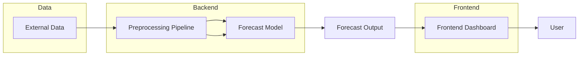
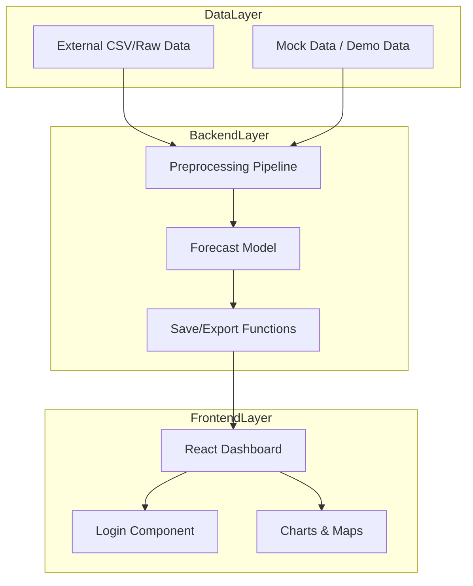

# DelDOT Revenue Forecast Technical Guide

## Purpose

This technical guide documents the architecture, technology stack, deployment process, and implementation details of the DelDOT Revenue Forecasting System.

## System Architecture

The system is divided into three main layers:

1. **Frontend** (`frontend_deldot/`)
2. **Backend / Data Processing** (`preprocessing/` and `Model/`)
3. **Data Layer** (`External_Data/`)

### Architecture Diagram



## Technology Stack

### Backend

- Python 3.8+
- `pandas` for data manipulation
- `scikit-learn` for preprocessing and modeling
- `scipy` for numeric computation
- `pytest` for testing (optional)

### Frontend

- React 19 + TypeScript
- Vite for development and build tooling
- `recharts` for chart rendering
- `d3` libraries for data-driven visualizations
- Tailwind CSS for styling
- `@google/genai` for Gemini AI integration
- `dotenv` for environment variable loading

### Deployment

- Static frontend built via `npm run build`
- Production deployment object can be hosted on AI Studio or any static host
- Backend components can be containerized or deployed as a Python service

## Code Structure

### Frontend (`frontend_deldot`)

- `src/App.tsx`: Main app shell and routing
- `src/components/Dashboard.tsx`: Key analytics and summary charts
- `src/components/DelawareMap.tsx`: Geographic visualization
- `src/components/Login.tsx`: Authentication interface
- `src/components/ReportView.tsx`: Report generation and summary view
- `src/components/RevenueChart.tsx`: Forecast charting logic
- `src/types/`: TypeScript interfaces for data and policy objects
- `src/utils/data.ts`: Data transformation helper functions

### Backend / Preprocessing

- `preprocessing/preprocessor.py`: Data processing pipeline entry point
- `preprocessing/utils/load_data.py`: CSV and external data loaders
- `preprocessing/utils/save_to_file.py`: Export helpers
- `preprocessing/utils/exception.py`: Custom exception handling
- `Model/DelDot1.py`: Forecast model logic and training

### Data Assets

- `External_Data/TOTALSA.csv`: Key dataset for revenue modeling

## Deployment and Run Process

### Frontend Deployment

1. Install dependencies:
   ```bash
   cd frontend_deldot
   npm install
   ```
2. Build production assets:
   ```bash
   npm run build
   ```
3. Deploy contents of `dist/` to any static site host or AI Studio app.

### Backend Pipeline

1. Install Python dependencies in virtual environment:
   ```bash
   python -m venv .venv
   .venv\Scripts\activate
   pip install -e .
   ```
2. Run preprocessing or model script as needed.

## Integration Points

- The frontend currently uses local mock data and is prepared for API integration.
- `@google/genai` is available for AI-driven capabilities and can be used in the frontend.
- Real backend API endpoints can be built later to serve processed forecast data.

## Security and Environment

- Environment variables are stored in `.env.local` for local development.
- `GEMINI_API_KEY` is required for AI Studio / Gemini integration.
- Do not commit API keys or secrets to version control.

## Testing

- Python tests are located in `preprocessing/tests/`
- Use `pytest` to run unit tests:
  ```bash
  .venv\Scripts\activate
  pytest
  ```

## Development Workflow

1. Update or add data to `External_Data/`
2. Run preprocessing in `preprocessing/`
3. Train or update model in `Model/DelDot1.py`
4. Refresh frontend charts and verify UI changes
5. Build and deploy the frontend when ready

## Architecture Notes

- The system is designed as a prototype with clear separation between UI and backend processing.
- Data transformations are centralized in the preprocessing package.
- Forecast output is delivered to the dashboard as structured JSON-like payloads.

## Diagram: Component Breakdown


